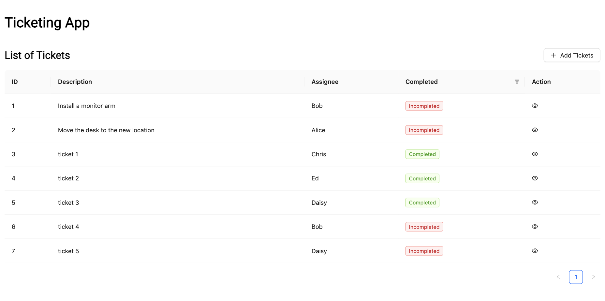
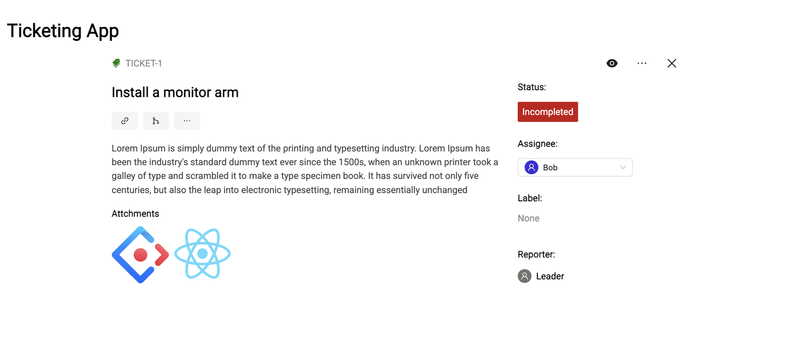

# Coding assignment

The goal of this assignment is to showcase your ability to develop features and your coding style. Due to the time
constraint you will have to prioritize what you work on, and have to try and balance cleanliness with just getting it
done.

Even though the app is small, one can easily spend the whole week working on it: perfecting styles, testing every single
method, or carefully crafting every single line of code. Please don't! Do as much as you can in about two hours and
share the results.

The most important part of the interview will come after this one, when we look at the app together, talk about the
decisions you have made, etc..

## Ticket Managing Application (React)

Fork the project, clone your fork locally, then install the packages and you're good to go!

```bash
yarn

# run client and server apps
yarn start

# run tests
yarn test
```

### Requirements

Build a ticket managing app, where the user can _add_, _filter_ (by status), _assign_, and _complete_ tickets.

- The app should have two screens:

  1. the list screen and
  2. the details screen.

- You can use any state management library you want (or none at all). e.g. redux, xstate, etc.

- You can use any styling library or methodology you want (or none at all). e.g. styled-components, tailwind, mui, etc.

- Write a couple of tests. The goal here is not to build a production-quality app, so don't test every single detail. Two or three tests should be good enough.

### UI Demo




### Server / API

The server application is available at http://localhost:4200/api when you run `yarn start`.

Note that there is an intentional artificial delay on the API - PLEASE DO NOT REMOVE IT! We've added it in as a way to check your frontend application's ability to handle race conditions/loading and pending states.

Please see the [API docs here](./server/README.md).

## Submitting your solution

Please send us the link to your repo on GitHub, Gitlab, etc. We will continue to work on it during the pair-programming
sessions. Please also indicate approximately how long you spent on the submission.
